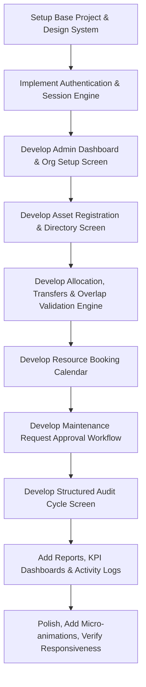

# AssetFlow: Enterprise Asset & Resource Management System

Welcome to the **AssetFlow** repository. This project is a user-centric, responsive, and high-fidelity Enterprise Asset & Resource Management System designed to simplify and digitize resource allocation, tracking, and maintenance.

---

## 📋 1. Project Overview & Requirements Map

AssetFlow coordinates physical assets, shared resources, employee assignments, and maintenance workflows through a centralized ERP platform.

### 👥 User Roles & Access Control
The system enforces strict role-based workflows to maintain data integrity and security.

* **Admin**:
  * Manages departments, asset categories, audit cycles, and employee directories.
  * Promotes employees to **Department Head** or **Asset Manager** (the only route for role changes).
  * Views global analytics.
* **Asset Manager**:
  * Registers and edits assets, sets "shared/bookable" resource flags.
  * Manages allocations, approves transfers, and resolves audit discrepancies.
  * Inspects returned assets and signs off on condition check-in notes.
* **Department Head**:
  * Views assets allocated to their department.
  * Approves internal allocations and transfer requests.
  * Reserves shared resources on behalf of their department.
* **Employee**:
  * Views currently allocated assets.
  * Reserves bookable assets/rooms through a time-slot scheduler.
  * Raises maintenance requests and triggers asset return/transfer flows.

---

## 🎨 2. Screen-by-Screen Blueprint (Parsed from Excalidraw Mockups)

To match the exact visual design and copy outlined in `AssetFlow - Enterprise Asset & Resource Management System - 8 hours.excalidraw`, our implementation will feature the following 10 screens:

### 🔐 Screen 1: Login & Account Creation
* **Title**: `AssetFlow - login`
* **Brand Logo**: `AF` emblem
* **Fields**: `Email` (placeholder: `name@company.com`), `Password` (placeholder: `**********`)
* **Actions**: `Forgot password` link, `Create Account` primary button
* **Employee Notice**: *"New here? Sign up creates an employee account; admin roles assigned later."*

### 📊 Screen 2: Dashboard / Today's Overview
* **KPI Ribbon**:
  * **Available Assets**: `128`
  * **Allocated Assets**: `76`
  * **Active Bookings**: `9`
  * **Pending Transfers**: `3`
  * **Upcoming Returns**: `12`
* **Alert Feed**: *"3 assets overdue for return - flagged for follow-up"* (with distinct overdue styling).
* **Quick Actions Panel**: `+ Register Asset`, `Book Resource`, `Raise Requests`.
* **Recent Activity Feed**:
  * *"Laptop AF-0114 - allocated to Priya Shah - IT dept"*
  * *"Room B2 - booking confirmed - 2:00 to 3:00 PM"*
  * *"Projector AF-0062 - maintenance resolved"*

### 🏢 Screen 3: Organization Setup (Admin Only)
* **Sub-Navigation Tabs**: `Departments`, `Categories`, `Employee` (with a `+ Add` button).
* **Departments Table**: Headers: `Department`, `Head`, `Parent Dept`, `Status`.
  * *Seed 1*: `Engineering` | `Aditi Rao` | `--` | `Active`
  * *Seed 2*: `Facilities` | `Rohan Mehta` | `--` | `Active`
  * *Seed 3*: `Field ops (east)` | `Sana Iqbal` | `Field Ops` | `Inactive`
* **System Tip**: *"Editing a department here also drives the picklists in Screens 4 & 5."*

### 📁 Screen 4: Asset Registrations & Directory
* **Header Controls**: Search bar (*"Search by tag, serial, or QR code..."*), filters for `Category`, `Status`, `Department`, and a `+ Register Asset` button.
* **Asset Directory Table**: Headers: `Tag`, `Name`, `Category`, `Status`, `Location`.
  * *Seed 1*: `AF-0012` | `Dell Laptop` | `Electronics` | `Allocated` | `Bengaluru`
  * *Seed 2*: `AF-0062` | `Projector` | `Electronics` | `Under Maintenance` | `HQ Floor 2`
  * *Seed 3*: `AF-0201` | `Office Chair` | `Furniture` | `Available` | `Warehouse`

### 🔄 Screen 5: Asset Allocation & Transfer (Double-Allocation Block)
* **Conflict Mode**: Active validation when attempting to allocate an asset that is currently taken.
  * Target Asset: `AF-0114 - Dell laptop`
  * Banner Message: *"Already Allocated to Priya Shah (Engineering). Direct re-allocation is blocked - submit a transfer request below."*
* **Request form**: `From` (pre-filled: `Priya Shah`), `To` (dropdown: `Select Employee...`), `Reason` text box, `Submit Request` button.
* **Per-Asset History Table**:
  * *"Mar 12 - Allocated to Priya Shah - Engineering"*
  * *"Jan 04 - Returned by Arjun Nair - condition: Good"*

### 📅 Screen 6: Resource Booking (Calendar Timeline)
* **Selector**: `Resource` selection (e.g. `Conference room B2 - Tue, 7 Jul`).
* **Visual Scheduler Grid**: Hour blocks showing active allocations and conflicts.
  * `9:00` ➔ Booked: *Procurement Team (9:00 to 10:00)*
  * `10:00` ➔ Conflict Blocked: *Requested 9:30 to 10:30 (slot is unavailable)*
  * `11:00` | `12:00` | `1:00` ➔ Empty slots.
* **Actions**: `Book a slot` button.

### 🔧 Screen 7: Maintenance Management (Kanban Board)
* **Columns**: `Pending` ➔ `Approved` ➔ `Technician Assigned` ➔ `In Progress` ➔ `Resolved`.
* **Workflow Tip**: *"Approving a card moves the asset to Under Maintenance; resolving returns it to Available."*
* **Kanban Card Data**:
  * *Pending*: `AF-0062` | *Projector bulb not turning on*
  * *Approved*: `AF-003` | *AC unit noisy compressor*
  * *Technician Assigned*: `AF-0078` | *Forklift (Tech: R. Varma)*
  * *In Progress*: `AF-897` | *Printer Jam (parts ordered)*
  * *Resolved*: `AF-873` | *Chair repair (resolved 7 Jul)*

### 🔍 Screen 8: Asset Audit
* **Active Cycle Header**: `Q3 audit: Engineering dept - 1-15 Jul` | Auditors: `A. Rao, S. Iqbal`.
* **Checklist Table**: Headers: `Asset`, `Expected Location`, `Verification`.
  * *Row 1*: `AF-003 Dell laptop` | `Desk E12` | `Verified` (Status icon: Green Check)
  * *Row 2*: `AF-9921 Office chair` | `Desk E14` | `Missing` (Status icon: Red Cross)
  * *Row 3*: `AF-9838 Monitor` | `Desk E15` | `Damaged` (Status icon: Orange Warning)
* **Discrepancy Banner**: *"2 assets flagged - discrepancy report generated automatically."*
* **Footer Action**: `Close Audit Cycle` (locks records, auto-updates statuses).

### 📈 Screen 9: Reports & Analytics
* **Visual Modules**: `Utilization by Department` chart, `Maintenance Frequency` chart.
* **Insights**:
  * **Most Used Assets**:
    * *Room B2*: 34 bookings this month
    * *Van AF-343*: 21 trips this month
    * *Projector AF-335*: 18 uses
  * **Idle Assets**:
    * *Camera AF-0301*: unused 60+ days
    * *Chair AF-0410*: unused 45 days
  * **Maintenance & Retirement Warnings**:
    * *Forklift AF-0087*: service due in 5 days
    * *Laptop AF-0020*: 4 years old (nearing retirement)
* **Action**: `Export Report` button.

### 🔔 Screen 10: Activity Logs & Notifications
* **Filters**: `All`, `Alerts`, `Approvals`, `Bookings`.
* **Timeline Feed**:
  * `2m ago` ➔ *Laptop AF-0014 assigned to Priya Shah*
  * `18m ago` ➔ *Maintenance request AF-0055 approved*
  * `1h ago` ➔ *Booking confirmed: Room B2 (2:00 to 3:00 PM)*
  * `3h ago` ➔ *Transfer approved: AF-0033 to Facilities dept*
  * `1d ago` ➔ *Overdue return: AF-0021 was due 3 days ago*
  * `2d ago` ➔ *Audit discrepancy flagged: AF-0088 damaged*

---

## 💾 3. Export Reporting Details: Excel & PDF

To support organizational planning, audit compliance, and accounting, the system features dedicated Excel and PDF export pipelines, optimized for a client-side SPA architecture.

### 📊 Excel (CSV Spreadsheet) Export Features
Excel exports provide structured raw datasets designed for sorting, sorting filters, accounting calculations, and external upload.

* **Asset Directory Spreadsheet**:
  * *Target Data*: Full asset catalog (Tag, Name, Category, Serial, Status, Current Holder, Location, Condition, Acquisition Cost, Acquisition Date, Expiry/Warranty).
  * *Formatting*: Auto-sanitized comma-delimited structure. Text fields with commas are properly quoted.
* **Audit Discrepancy Ledger**:
  * *Target Data*: List of all assets under the active audit scope.
  * *Columns*: Tag, Asset Name, Expected Location, Verified Status, Auditor Notes, Discrepancy Action (e.g. *"Needs Replacement"* or *"Lost Investigation"*).
* **TCO & Maintenance Expense Tracker**:
  * *Target Data*: Request details, priority, technician, downtime duration, parts cost, and asset categories.
  * *Use Case*: Allows finance teams to calculate total cumulative maintenance spend vs. asset acquisition value.

### 📄 PDF Document Export Features
PDF exports provide formal, stylized, and print-ready documents suitable for board reviews, operational sign-offs, or physical tags.

* **Executive Summary Report (Screen 9)**:
  * *Content*: High-level summary of total assets, category values, and usage trends. Includes stylized tables of *Most Used Assets*, *Idle Assets*, and *Assets Nearing Retirement*.
  * *Layout*: Professional header, branded colors, layout grid, and a summary section with date and signature of the compiling manager.
* **Audit Discrepancy & Verification Report (Screen 8)**:
  * *Content*: Formal verification document detailing audit statistics (e.g., 94% Verified, 4% Damaged, 2% Missing).
  * *Layout*: Scoped cycle headers (Date Range, Auditor Names, Department), table listing only the flagged discrepancy assets, and a double-signature line at the footer for legal audit closure.
* **Asset QR Code Tag Sheet**:
  * *Content*: Grids of high-contrast, scan-ready QR codes.
  * *Layout*: A pre-aligned sticker-sheet template. Each badge has the QR code, Asset Tag, and company name.

### 🛠️ Client-Side SPA Implementation Architecture
Since we are building a 100% self-contained frontend application:
1. **Excel/CSV Engine**:
   * Programmatically converts standard JSON states into RFC-compliant CSV strings using a helper function.
   * Leverages browser-initiated file downloads via temporary `<a download="...">` elements wrapping base64-encoded file blobs.
2. **PDF Engine (Double-Pipeline)**:
   * **Pipeline A (Print Layout)**: CSS print styles (`@media print`). Hides application sidebars, filters, and navs. Formats reports onto perfect A4 sheets with page breaks, header titles, and signature sections when the user triggers print.
   * **Pipeline B (Client PDF)**: Generates a vector PDF directly from the UI states using client-side canvas engines, providing direct local saving.

---

## 🌳 4. Implementation Steps

